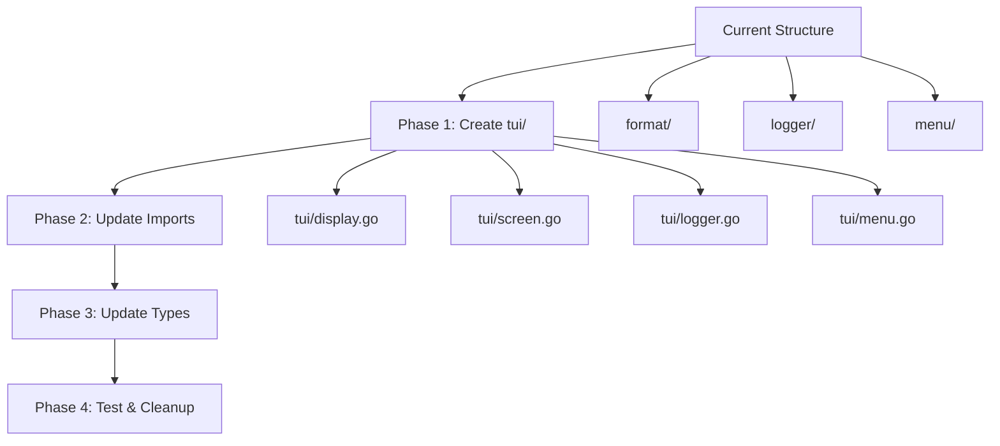

# Refactoring Plan: Merge format/, logger/, and menu/ into tui/

## Overview

This plan outlines the consolidation of three Go packages (`format/`, `logger/`, `menu/`) into a single `tui/` package to eliminate duplicate code, resolve potential circular dependencies, and improve code organization.

## New Package Structure

**Package Name:** `tui` (Text User Interface)

**Directory Structure:**
```
tui/
├── display.go    # Display formatting and IMDb utilities
├── screen.go     # Terminal screen utilities and colors
├── logger.go     # Logger struct and methods
└── menu.go       # Menu and episode navigation
```

## Resolved Issues

### Duplicate Code Elimination

1. **ParseIMDbID Function**
   - **Before:** Two versions with different signatures
     - `format/display.go`: `ParseIMDbID(imdbID string) (stream.MediaType, int, int)`
     - `menu/menu.go`: `ParseIMDbID(imdbID string) (int, int)`
   - **After:** Single unified function in `tui/display.go` returning `(stream.MediaType, int, int)`

2. **ClearScreen Function**
   - **Before:** Identical implementations in `format/screen.go` and `logger/screen.go`
   - **After:** Single implementation in `tui/screen.go`

3. **getTerminalSize Function**
   - **Before:** Identical private functions in both screen files
   - **After:** Single private function in `tui/screen.go`

4. **Screen Display Functions**
   - **Before:** `ShowPromptAtBottom` (format) and `showAtBottom` (logger, private, with color support)
   - **After:** Unified `ShowAtBottom` (public) in `tui/screen.go` with color support; `ShowPromptAtBottom` as convenience wrapper

### Circular Dependency Prevention

- **Before:** Potential cycle if `menu` imports `format` and `format` imports other packages that might import `menu`
- **After:** All dependencies consolidated in `tui/`, no internal cycles

## Functionality Preservation

All existing public APIs are maintained with the following changes:
- Package prefix: `format.` → `tui.`, `logger.` → `tui.`, `menu.` → `tui.`
- Logger type: `*logger.Logger` → `*tui.Logger`
- Function signatures remain identical except where unified

## Implementation Steps

### Phase 1: Create New Package Structure

1. Create `tui/` directory
2. Create `tui/display.go`:
   - Copy content from `format/display.go`
   - Change package declaration to `tui`
   - Keep all imports and functions unchanged

3. Create `tui/screen.go`:
   - Start with content from `logger/screen.go` (includes color support)
   - Add `ShowPromptAtBottom` function:
     ```go
     func ShowPromptAtBottom(prompt string) {
         ShowAtBottom(prompt, colorDefault)
     }
     ```
   - Change package declaration to `tui`

4. Create `tui/logger.go`:
   - Copy content from `logger/logger.go`
   - Change package declaration to `tui`
   - Update method calls to use `screen.` prefix:
     - `ClearScreen()` → `screen.ClearScreen()`
     - `showAtBottom(...)` → `screen.ShowAtBottom(...)`

5. Create `tui/menu.go`:
   - Copy content from `menu/menu.go`
   - Change package declaration to `tui`
   - Remove duplicate `ParseIMDbID` function (use unified version from display.go)

### Phase 2: Update Import Statements

Update all files that import the old packages:

1. **`playback/playback.go`**:
   - Change `"imdb/format"` → `"imdb/tui"`
   - Change `"imdb/logger"` → `"imdb/tui"`
   - Change `"imdb/menu"` → `"imdb/tui"`

2. **`main.go`**:
   - Change `"imdb/logger"` → `"imdb/tui"`

3. **`search/search.go`**:
   - Change `"imdb/logger"` → `"imdb/tui"`

4. **`selection/episodes.go`**:
   - Change `"imdb/logger"` → `"imdb/tui"`

### Phase 3: Update Type References

Update all type references in the codebase:

1. **Logger Type**:
   - `log := logger.New()` → `log := tui.New()`
   - `*logger.Logger` → `*tui.Logger`

2. **Function Calls** (examples):
   - `format.GetMediaTypeString(...)` → `tui.GetMediaTypeString(...)`
   - `menu.ShowPostPlayMenu(...)` → `tui.ShowPostPlayMenu(...)`
   - `menu.GetNextEpisode(...)` → `tui.GetNextEpisode(...)`
   - `menu.GetPreviousEpisode(...)` → `tui.GetPreviousEpisode(...)`

### Phase 4: Testing and Cleanup

1. Run `go build` to ensure no compilation errors
2. Run tests if available
3. Remove old directories: `format/`, `logger/`, `menu/`
4. Update any documentation referencing the old package names

## Migration Flow Diagram



## Risk Assessment

- **Low Risk:** All functions are preserved with same signatures
- **Low Risk:** No external API changes (internal refactoring)
- **Medium Risk:** Large number of import updates (use find/replace carefully)
- **Low Risk:** No database or network dependencies affected

## Rollback Plan

If issues arise:
1. Revert import changes
2. Restore old directories from git/version control
3. Revert type references
4. Test functionality

## Expected Benefits

- Eliminated code duplication (~100 lines reduced)
- Simplified dependency management
- Improved maintainability
- Better code organization by functionality
- Reduced risk of circular dependencies